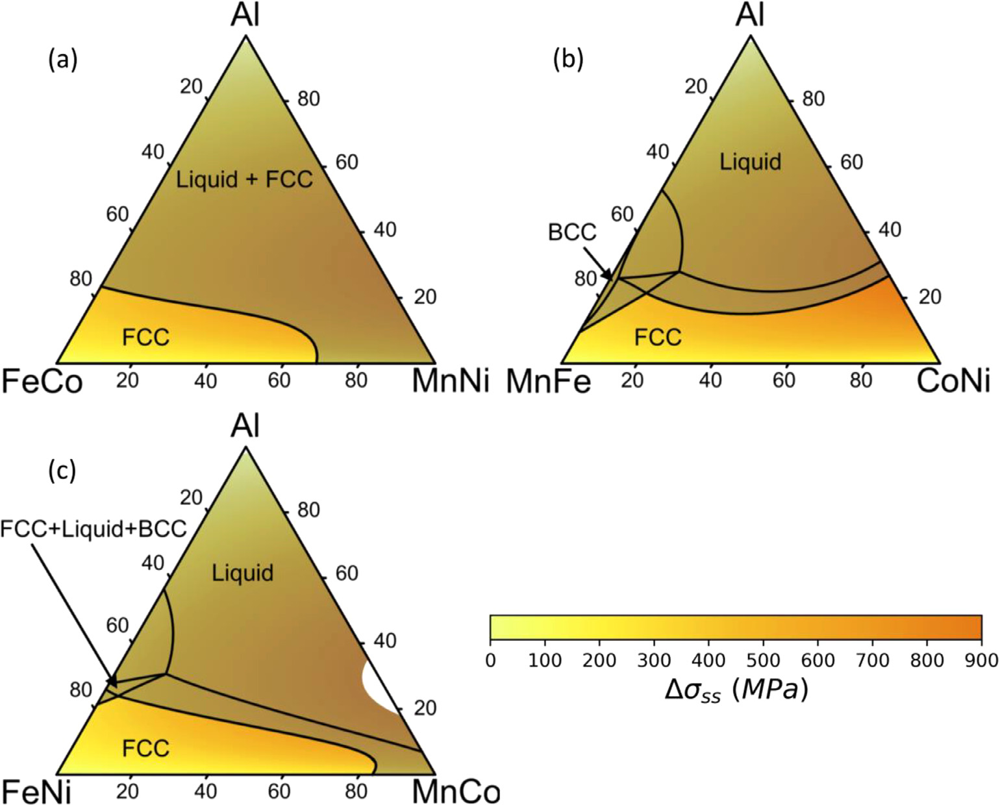
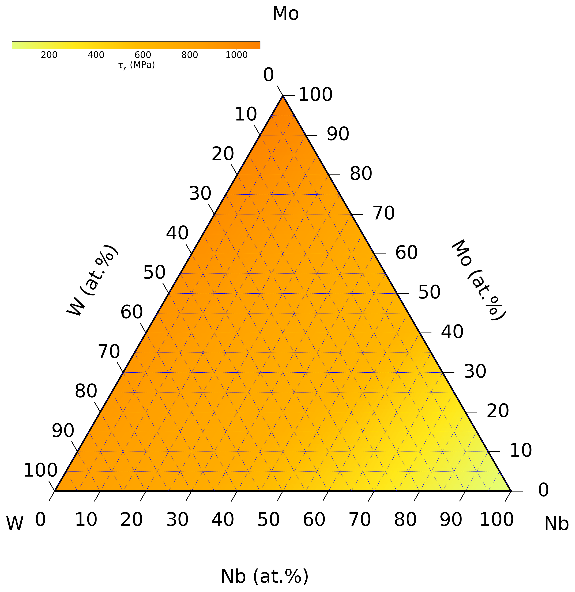
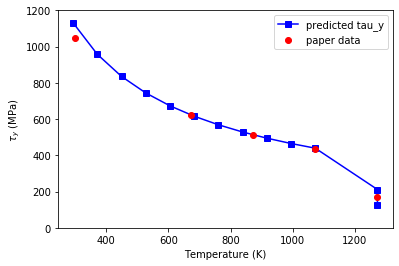

# pySSpredict

## Description
**pySSpredict** is a **Py**thon-based tool for **S**olid-solution **S**trengthening **predict**ion for complex-concentrated alloys. It can be easily installed on the high-throughput computation resources and integrated with TC-Python for desiging high-temperature high-strength structural materials.  

## Models
**Solid solution strengthening models:**  
FCC edge dislocation-solute interaction [C. Varvenne, G.P.M. Leyson, M. Ghazisaeidi, W.A. Curtin (2017)](http://dx.doi.org/10.1016/j.actamat.2016.09.046)  
BCC edge dislocation-solute interaction  [F. Maresca, W.A. Curtin (2019)](https://doi.org/10.1016/j.actamat.2019.10.015)  
BCC screw dislocation-solute interaction [F. Maresca, W.A. Curtin (2019)](https://doi.org/10.1016/j.actamat.2019.10.007)   
BCC screw dislocation-solute Suzuki model [S.I. Rao, C. Woodward, B. Akdim, O.N. Senkov, D. Miracle (2021)](https://doi.org/10.1016/j.actamat.2021.116758)  

## Examples
Jupyter notebooks:   
[Simple calculations and plots](https://github.com/Dongsheng-Wen/pySSpredict/blob/ea66bb772439c7866ea29d864c3a180787effa38/notebook/reproduce_data.ipynb)  
[FCC_edge](https://github.com/Dongsheng-Wen/pySSpredict/blob/ea66bb772439c7866ea29d864c3a180787effa38/notebook/FCC_edge_model_example.ipynb)  
[BCC_edge](https://github.com/Dongsheng-Wen/pySSpredict/blob/ea66bb772439c7866ea29d864c3a180787effa38/notebook/BCC_edge_model_example.ipynb)  
[BCC_screw](https://github.com/Dongsheng-Wen/pySSpredict/blob/ea66bb772439c7866ea29d864c3a180787effa38/notebook/BCC_screw_Curtin_model_example.ipynb)

### [FCC edge dislocation-solute interaction](http://dx.doi.org/10.1016/j.actamat.2016.09.046)  

   

 Pseudo-ternary FeMnCoNi+Al FCC complex concentrated alloys predicted by the edge dislocation model. [Adapted from study](https://doi.org/10.1016/j.mtla.2019.100539)   
 

### [BCC screw dislocation-solute interaction](https://doi.org/10.1016/j.actamat.2019.10.007)   


    

Ternary NbMoW BCC alloys predicted by the screw dislocation-solute interaction model. 


### [BCC screw dislocation-solute Suzuki model](https://doi.org/10.1016/j.actamat.2021.116758)  

    

Yield stress-tempreature relationship of BCC TiNbZr alloy predicted by the Suzuki model.  

## Options for high-throughput calculations and materials selection

See [this example Jupyter Notebook](https://github.com/Dongsheng-Wen/pySSpredict/blob/ea66bb772439c7866ea29d864c3a180787effa38/notebook/HTP_workflow.ipynb) for high-throughput calculations.

You can use pySSpredict together with TC-python for both mechanical properties and phase stability predictions. See [this Jupyter Notebook](https://github.com/Dongsheng-Wen/pySSpredict/blob/919612c4a8ecb2ee13360e73f5edc4cde85368b1/notebook/sspredict_tcpython_workflow.ipynb) that runs on the cluster. 

## Install
- Clone the project.
- In the project directory:  
   ```pip install .```
   
## Future: Model Implementations
- Ductility model for BCC materials.

